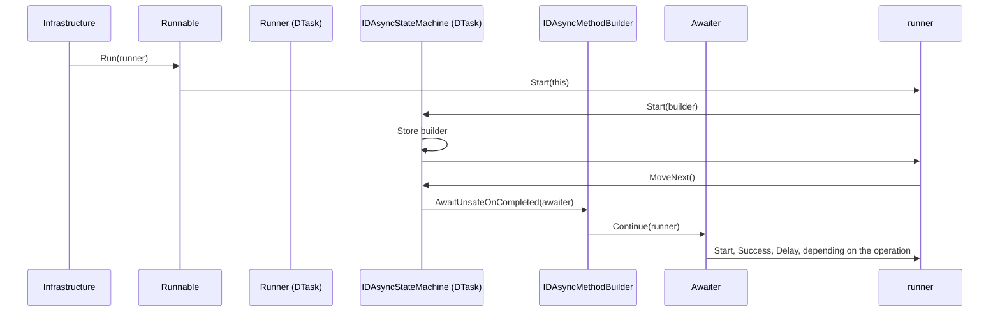

# DTasks core library

`DTask` is the type the whole project revolves around, but there are other key components that are fundamental to the whole d-async pattern.
This document outlines the main API design choices and the most important implementation details.

## API

### Integration with async/await

The first key feature is the integration with `async`/`await`.

To make this type awaitable, it should implement the awaitable/awaiter pattern:

- `DTask` should define a `GetAwaiter()` method returning its awaiter.
- `DTask.Awaiter` defines the `IsCompleted` property and the `GetResult` method, and implements `ICriticalNotifyCompletion`.

Making it work with the async keyword is a bit more elaborate, but a standard procedure:

- Define an async method builder, `AsyncDTaskMethodBuilder`, with the members required by the compiler.
- Decorate the `DTask` type with the `[AsyncMethodBuilder(typeof(AsyncDTaskMethodBuilder))]`.

### Task-like API

The second principle is keeping the API as close as possible to `Task`.
Like `Task`, a `DTask` may represent an asynchronous method or any other kind of operation that completes in the future.
`DTask<TResult>` is a `DTask` that produces a value as the result of the operation, hence, like `Task`, `DTask<TResult>` inherits from `DTask`.

Also, the following static members are defined:

- `DTask.CompletedTask`
- `DTask.FromResult<TResult>(TResult result)`
- `DTask.FromException(Exception exception)`
- `DTask.FromCanceled` (not yet implemented, requires defining cancellation)
- `DTask.Delay(TimeSpan delay)`
- `DTask.Yield()`
- `DTask.Run(DTask task)`
- `DTask.WhenAll(params IEnumerable<DTask> tasks)`
- `DTask.WhenAny(params IEnumerable<DTask> tasks)`
- `DTask.WhenEach(params IEnumerable<DTask> tasks)` (not yet implemented, requires defining d-async enumerable)
- `DTask.Factory` (even though the API of the factory itself does not need to mirror `TaskFactory`)

As well as the following instance members:

- `DTask<TResult>.Result`
- `DTask.Exception`
- `DTask.Status`

As for the status flags (`IsCompleted`, `IsCanceled`, etc.), they vary a bit to be consistent with the names of the statuses `DTask` defines:

- `Pending` (`DTask.IsPending`)
- `Running` (`DTask.IsRunning`)
- `Succeeded` (`DTask.IsSucceeded`)
- `Suspended` (`DTask.IsSuspended`)
- `Canceled` (`DTask.IsCanceled`)
- `Faulted` (`DTask.IsFaulted`)

Additionally, the following members are defined:

- `DTask.IsCompleted` (when the status is `Succeeded`, `Canceled`, or `Faulted`)
- `DTask.IsFailed` (when the status is `Canceled` or `Faulted`)

## Semantics

### Laziness

The main difference in semantics with `Task` is that a `DTask` does not start upon creation.
This means that when invoking a `DTask`-returning async method (or d-async method, for short), it doesn't begin executing its logic.
Awaiting the `DTask` is what starts its execution.

Let's consider the following example.

```csharp
DTask task = Greetings();
Console.WriteLine("Hello!");
await task;

async DTask Greetings()
{
    Console.WriteLine("Good morning!");
    await DTask.Delay(TimeSpan.FromHours(1));
    Console.WriteLine("Good evening!");
}
```

If `DTask` followed the same semantics of `Task`, we would have the following output:

```text
Good morning!
Hello!
Good evening!
```

Instead, what we observe is:

```text
Hello!
Good morning!
Good evening!
```

APIs like `DTask.Delay`, `DTask.WhenAll`, `DTask.WhenAny` follow the same semantics.
For example:

```csharp
DTask task = DTask.Delay(TimeSpan.FromMinutes(10));
await Task.Delay(TimeSpan.FromMinutes(5));
await task; // This will wait for 10 minutes, not 5!
```

In other words, `DTask` represents the instructions on what awaiting that `DTask` should do.
In a sense, it kind of behaves like `Lazy<Task>`.

However, this limits what we can do with `DTask`.
For example: how to start a fire-and-forget job?
This is what `DTask.Run` is for: it accepts a `DTask` to start in the background and returns another `DTask` that can be (optionally) awaited to get the result.
Contrary to `Task.Run`, `DTask.Run` must be awaited as well:

```csharp
DTask<int> myBackgroundTask = await DTask.Run(SomeBackgroundJob());
// Do other stuff...
int result = await myBackgroundTask;

async DTask<int> SomeBackgroundJob()
{
    // Some logic
}
```

### Awaiting

`DTask` is designed to represent operations whose lifetime is comparable to the retention of the infrastructure that supports it.
This easily includes operations that can take days, if not months.
It would not be wise to wait for this long in the middle of a *locally* async method, and even less in a synchronous one.
Therefore, `DTask.Result` and `DTask.Exception` throw if the `DTask` wasn't previously awaited.
More importantly, awaiting a `DTask` in a regular async method will throw as well.

## Infrastructure

`DTask` has a static API: `DTask.Run`, `DTask.Delay`, and so on.
How do we make this pluggable and extensible to make it work with different kinds of components?
One approach could be relying on some ambient data, namely, using `AsyncLocal`.
Although powerful, it feels like using a workaround and there are some catches with its usage; we can do better than this.
Every environment that wants to run a `DTask` will need to have a way to start the entrypoint of the whole d-async flow, especially considering that `DTask`s are lazy and they can't be awaited in regular async methods.

The proposed solution is to let `DTask` implement two interfaces: one of them is just the public API described above; the other one is intended for the infrastructure components that will run it. This new interface was, quite expectedly, named `IDAsyncRunnable`.

```csharp
public interface IDAsyncRunnable
{
    void Run(IDAsyncRunner runner);
}
```

An `IDAsyncRunnable` is just an object that exposes a `Run` method that accepts a single parameter of type `IDAsyncRunner`.
The `IDAsyncRunner` is the component that runs the whole d-async flow: we already see that this simple solution already allows to specify any implementation of this component.

> As a bonus, since IDAsyncRunner can run any object implementing IDAsyncRunnable, we can have custom runnable types, not just DTask. For the rest of this paragraph, this documentation will address d-async runnables instead of DTasks.

A d-async runner should be able to handle every d-async operation that we defined so far: `DTask.Delay`, `DTask.WhenAll`, and, most importantly, d-async runnables representing d-async methods.
Therefore, let's have its interface define ways to tell it what operation it must run.

```csharp
public interface IDAsyncRunner
{
    void Start(IDAsyncStateMachine stateMachine); // To start a d-async method, like async DTask

    void Succeed(); // To handle a completed operation, like DTask.CompletedTask

    void Succeed<TResult>(TResult result); // To handle a completed operation, like DTask.FromResult(...)

    void Fail(Exception exception); // To handle an exception, like DTask.FromException(...)

    void Delay(TimeSpan delay); // To handle a delay, like DTask.Delay

    // And more
}
```

When calling the `Run` method on an `IDAsyncRunnable`, it will in turn call the appropriate method on the runner and provide the relevant arguments.
Rings a bell?
You're right, that is the visitor pattern in disguise.

The `IDAsyncStateMachine` interface is used by the runner to control the execution of the d-async method. A d-async runnable that represents a d-async method should provide the runner with an instance of this interface:

```csharp
public interface IDAsyncStateMachine
{
    void Start(IDAsyncMethodBuilder builder);

    void MoveNext();

    void Suspend();
}
```

This interface exposes the following methods:

- `Start`: sets up the d-async state machine and provides it an `IDAsyncMethodBuilder` to drive its execution (more on it later)
- `MoveNext`: moves the d-async state machine to its next state (executes the d-async method in between await points)
- `Suspend`: imperatively causes the d-async state machine to save its state for suspension

The `IDAsyncMethodBuilder` is the equivalent of a regular async method builder:

```csharp
public interface IDAsyncMethodBuilder
{
    void AwaitOnCompleted<TAwaiter>(ref TAwaiter awaiter)
        where TAwaiter : INotifyCompletion;

    void AwaitUnsafeOnCompleted<TAwaiter>(ref TAwaiter awaiter)
        where TAwaiter : ICriticalNotifyCompletion;

    void SetResult();

    void SetResult<TResult>(TResult result);

    void SetException(Exception exception);

    void SetState<TStateMachine>(ref TStateMachine stateMachine)
        where TStateMachine : notnull;
}
```

The d-async method builder is used by the d-async state machine to communicate with the outside world, that is, the infrastructure that is running the d-async flow.
It comes with the usual methods a regular async method builder has, with the addition of the `SetState` method.
This method should be called by the d-async state machine on suspension, and passes the underlying state machine for saving it, if the implementation needs it.
Like `SetResult` and `SetException` is a "terminal" method, at least from the perspective of the local async flow.

> The `SetState` method has that name for consistency, because like SetResult and SetException is called when the d-async state machine transitions into a terminal state.

## Implementation

But how does all this play with the `await` keyword?
Like specified in the API design, a `DTask` only starts when awaited.
This means that awaiting a `DTask` should cause the corresponding method on the runner to be called.

`await` is just syntactic sugar that, within the `MoveNext` method of the generated state machine, the compiler translates into something like:

```csharp
var awaiter = task.GetAwaiter();
if (!awaiter.IsCompleted)
{
    <>t__builder.AwaitUnsafeOnCompleted(ref awaiter, ref this);
    return;
}
var result = awaiter.GetResult();
```

To make the d-async flow continue, `<>t__builder` must have access to the d-async method builder and delegate the logic of `AwaitUnsafeOnCompleted` to it.

An awaitable that wants to interact with the d-async flow should add the `IDAsyncAwaiter` interface to its awaiter:

```csharp
public interface IDAsyncAwaiter
{
    bool IsCompleted { get; }

    void Continue(IDAsyncRunner runner);
}
```

When `Continue` is called, it invokes the appropriate method on the runner.
This process repeats until a terminal method (`SetResult`, `SetException`, or `SetState`) finalizes the execution.

`DTask` implements this pattern by defining its own awaiter (`DTask.Awaiter`) and async method builder (`AsyncDTaskMethodBuilder`).

When the state machine is constructed, `AsyncDTaskMethodBuilder` works almost exactly like `AsyncTaskMethodBuilder`: it boxes the state machine within a class that IS the `DTask` that represents the async method (the only difference is that the boxing happens right away, see `DTaskBuilder.Create`).

```csharp
[EditorBrowsable(EditorBrowsableState.Never)]
public struct AsyncDTaskMethodBuilder
{
    private DTaskBuilder<VoidDTaskResult>? _builder;

    private readonly DTaskBuilder<VoidDTaskResult> Builder
    {
        get
        {
            Assert.NotNull(_builder, $"'{nameof(Start)}' was not invoked.");
            return _builder;
        }
    }

    public readonly DTask Task => Builder;

    public void Start<TStateMachine>(ref TStateMachine stateMachine)
        where TStateMachine : IAsyncStateMachine
    {
        DTaskBuilder<VoidDTaskResult>.Create(ref stateMachine, ref _builder);
    }
}

internal abstract class DTaskBuilder<TResult> : DTask<TResult>
{
    // Rest of the class

    public static void Create<TStateMachine>(ref TStateMachine stateMachine, [NotNull] ref DTaskBuilder<TResult>? builderField)
        where TStateMachine : IAsyncStateMachine
    {
        var box = new DAsyncStateMachineBox<TStateMachine>();
        builderField = box;
        box.StateMachine = stateMachine;
    }

    private sealed class DAsyncStateMachineBox<TStateMachine> : DTaskBuilder<TResult>, IDAsyncStateMachine
        where TStateMachine : IAsyncStateMachine
    {
        public TStateMachine StateMachine;

        // Rest of the class
    }
}
```

The state machine box IS also the `IDAsyncStateMachine` and it forwards the `MoveNext` call to the boxed state machine.
When the `IDAsyncRunnable.Run` method is called on a `DTask` that represents a d-async method, the box will call the `Start` method on the runner.

```csharp
protected override void Run(IDAsyncRunner runner)
{
    runner.Start(this);
}
```

This will cause the runner to call the `IDAsyncStateMachine.Start` on the box.
When this happens, the box will store the d-async method builder, so when `AwaitUnsafeOnCompleted`, `SetResult`, and `SetException` are called, it can forward the call to the corrisponding methods on the d-async builder.

If this sounds convoluted, it's because it is; so, let's visualize it to see the chain of invocations that were just described.



This complicated dance of builders, runners, and awaiters still does not explain:

- How to actually perform asynchronous work, since all methods are synchronous
- How to resume execution after suspension
- How to determine when a d-async operation that caused the flow to suspend completed

This is up to the implementation of the infrastructure interfaces (`IDAsyncRunner` and `IDAsyncMethodBuilder`) and is covered in the [relevant document](./infrastructure.md).