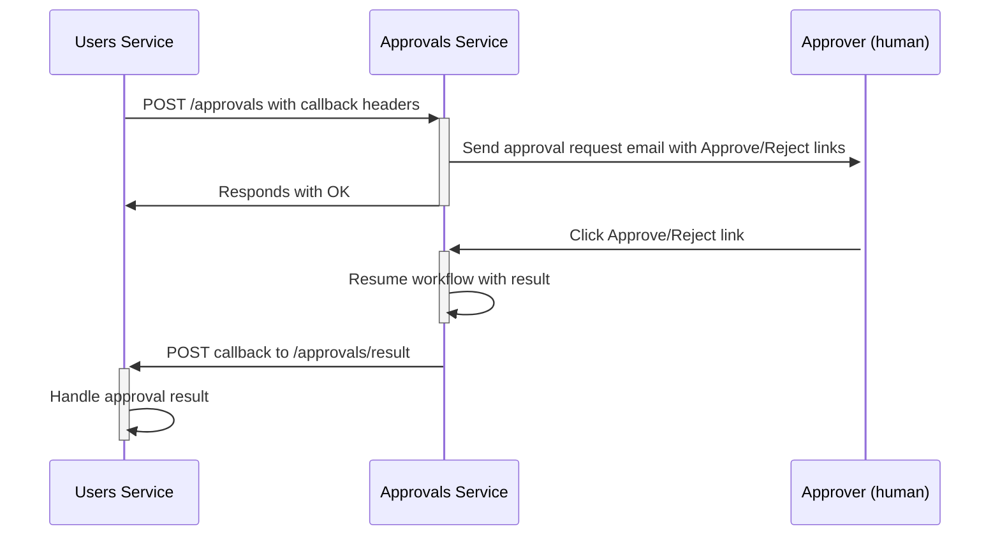
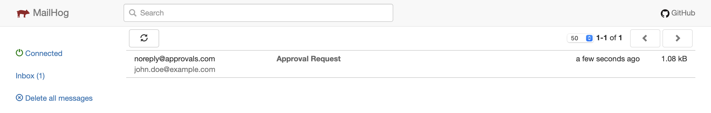
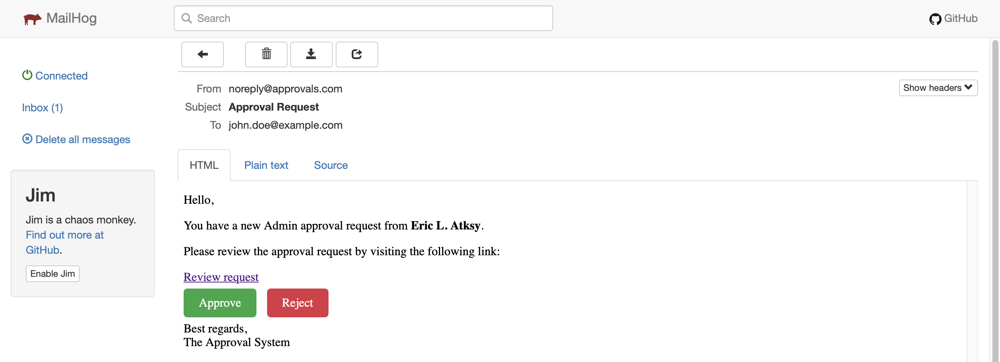

# ApprovalWorkflow sample

This sample demonstrates how DTasks can be used to orchestrate a distributed approval workflow across multiple services.
In this case, there are two services that interop to manage long-running approval requests that include human interaction.

- **Approvals**: This service uses DTasks.AspNetCore to define an async endpoint that starts a generic approval workflow. The caller defines what kind of approval the workflow handles and gets automatically notified when the workflow completes.

- **Users**: Handles user information and integrates with the Approvals service by calling its approval workflow async endpoint, providing the details of the approval and a callback URI to be notified when the decision is made. It does *not* use DTasks.

## Workflow

1. The Users service starts an approval request by calling `/approvals`.
2. The Approvals service retrieves the email address of the approver that was specified by the User service and, if found, sends an email providing two links: one for approval and one for rejection.
3. The Approvals Service waits for a decision:
  - If an approver provides input within 7 days, the result is sent back.
  - Otherwise, the request times out and is automatically rejected.
4. Once a decision is reached, the Users Service gets notified via the provided webhook.

This diagram shows the main flow.



## How you write it

DTasks enables defining this workflow with a single d-async method (an async method returning `DTask`), rather than writing multiple components:

- A method containing the logic for starting the approval, which corresponds to the `/approval` endpoint.
- A method to resume the workflow once human input is provided.
- A distributed background job that tracks the 7-day timeout.
- Logic to persist the workflow state.

With DTasks, this can be achieved by defining a single method that represents the whole workflow by defining its steps.

```csharp
using DTasks;
using DTasks.AspNetCore;
using Microsoft.AspNetCore.Mvc;

namespace Approvals;

using DTasks;

public class AsyncEndpoints(
    ApproverRepository repository, // Dependency injection is supported
    ApprovalService service)
{
    [HttpPost("approvals")] // Map your async endpoint using ASP.NET Core attributes
    public async DTask<IResult> NewApproval(NewApprovalRequest request) // Returning DTask allows you to write async endpoints
    {
        // Look up approver's email in the database
        string? email = await repository.GetEmailByIdAsync(request.ApproverId); // Await any "normal" Tasks, including those that are non-deterministic or have side effects
        if (email is null)
            return Results.BadRequest("Invalid approver id");

        // Send approval/rejection links to the approver
        DTask<ApprovalResult> approvalTask = service.SendApprovalRequestDAsync(request.Details, email); // This DTask will complete when the approver clicks on either link
        DTask timeout = DTask.Delay(TimeSpan.FromDays(7)); // Give them 7 days to review the request

        // Wait until either the approver reviews the request or the timeout expires
        DTask winner = await DTask.WhenAny(timeout, approvalTask); // DTasks has an API similar to Task, including DTask.WhenAny, DTask.WhenAll, etc.
        ApprovalResult result = winner == timeout
            ? ApprovalResult.Reject
            : approvalTask.Result; // "DTask.Result" can be accessed only if the DTask was awaited, otherwise it throws

        return AsyncResults.Success(result); // If you need to return IResult, use AsyncResults.Success to terminate the workflow
    }
}
```

### Monitoring the Workflow Status

In addition to this, you get an endpoint to monitor the status of the workflow.
After starting an approval, an operation ID is associated with the instance of the workflow and can be used to retrieve its status and result.

For example, calling `GET /approvals/{operationId}` before a result is available would return:

```json
{
    "status": "pending"
}
```

Once the workflow completes, the response would be:

```json
{
    "status": "complete",
    "value": 1
}
```

## How it works

> ⚠️ **Note**: The DTasks.AspNetCore is a work in progress, and many of its functionalities, including code generation, are still to be implemented. The sample code provides placeholders for what will eventually be generated, enclosed in a "Generated" region or placed in a "Generated" folder. This code is not final, and its purpose is to show how the sample works behind the scenes.

Based on the code in the `AsyncEndpoint` and `ApprovalService classes`, three endpoints are generated:

1. `POST /approvals`: Generated from the `[HttpPost("approvals")]` attribute on the `NewApproval` method of `AsyncEndpoints`. This endpoint behaves as expected but returns a response after the first d-async yield point (after await DTask.WhenAny), rather than at the end of the method.
2. `GET /approvals/{operationId}`: This endpoint is automatically generated to monitor the workflow status and retrieve its result.
3. `GET /approvals/{id}/{result}`: Generated from the hypothetical `[DAsyncCallback(route: "approvals/{$id}/{$result}", Method = "get")]` attribute on the `SendApprovalRequestDAsync` method in `ApprovalService`. This endpoint resumes the workflow by providing a result to the approvalTask.

## How to run the sample

This section shows how to run the sample to see DTasks in action.

### Prerequisites

- .NET 9
- Docker Desktop

### 1. Starting the services

This folder contains a *docker-compose.yml* file that can be used to spin up containers that support the persistence and the email feature of this sample.

To start, make sure Docker Desktop is running. Then, just open a terminal and run `docker compose up`.
Wait for the containers to be up and running.
This will start the following services:

- A **PostgreSQL** container (exposed on port 5432) - used for storing the approver email addresses.
- A **Redis** instance (exposed on port 6379) used to persist the workflow status.
- A **MailHog** service (exposed on port 8025) – provides a fake mailbox to receive and view approval emails.

Now, navigate to `http://localhost:8025` in your browser.
You will need this to confirm or reject approval requests later.

### 2. Starting the services

Open two new terminal windows, and navigate to the Approvals and Users subfolders, respectively.
Then, run `dotnet run` in each terminal.
This will start:

- The **Approvals** service (running on port 5033).
- The **Users** service (running on port 5017).

### 3. Placing breakpoints (optional)

If you'd like to step into the code, the following breakpoints are recommended:

- `Approvals/AsyncEndpoints.cs, line 14`: This is where the workflow starts. Here, the connection with the caller is still open.
- `Approvals/ApprovalService.cs, line 18`: When calling `DTask.WhenAny` in the `NewApproval` method, it will run the callback defined by `SendApprovalRequestDAsync`, where the email is sent to the approver.
- `Approvals/AsyncEndpoints.cs, line 22`: This is where the workflow is resumed after the approver clicks on either the "Approve" or "Reject" link.
- `Users/Program.cs, line 9`: This is the entrypoint of the workflow.
- `Users/Program.cs, line 32`: This is the final step of the workflow, where the caller is notified with the result.

### 4. Starting the approval

In a new terminal, send a POST request to the /approvals/start endpoint of the Users service:

`curl -X POST http://localhost:5017/approvals/start`

> Instead of the terminal, you can use any API client you prefer.

This will initiate a new "Admin" approval request, meaning the requestor is asking for an admin role assignment.
The request specifies the approver’s ID, which corresponds to the "John Doe" user (you can see available users in the database by checking the `init.sql` file).

If everything works as expected, you'll receive a response like the following:

```txt
Go to http://localhost:5033/approvals/ee562da3-b31b-4c66-a3ad-0f625bd49461 to monitor the status of the approval
```

Click the link or send a GET request to the provided URI. You should receive a response that indicates that the workflow is still in progress:

```json
{
    "status": "pending"
}
```

Additionally, the Users service should log the following:

```txt
info: Program[0]
      Started a new approval with id ee562da3-b31b-4c66-a3ad-0f625bd49461
```

### 5. Shutting down the Approvals service (optional)

If you're debugging the workflow, you may notice that the Users service received a response (202 Accepted) even though the `NewApproval` method hasn't returned yet.

This is because the method execution was suspended and its status persisted, while the caller is not blocked. In the next step, we’ll resume the method execution after human input.

To verify the workflow’s persistence, you can shut down the Approvals service; just remember to restart it before proceeding to the next step.

### 6. Finalizing the approval

Meanwhile, you should have received an email in the MailHog interface.



Open the email, and you'll see two buttons to either approve or reject the request.



Let's click the "Approve" button to approve the request.
This will trigger an HTTP request to the Approvals service, resume the workflow, and ultimately notify the Users service with the result.

> If you placed a breakpoint at `Approvals/AsyncEndpoints.cs, line 22` and restarted the Approvals service, you might be surprised to see that the method resumed in the same state, even after a temporary shutdown. Try hover over the `request` or `email` locals to verify that their value hasn't changed.

Since you approved the request, the Users service should log the following:

```txt
info: Program[0]
      Approval ee562da3-b31b-4c66-a3ad-0f625bd49461 finished with result Approved
```

If you perform a GET request to the monitor endpoint (`http://localhost:5033/approvals/{operationId}`) again, the response should indicate that the workflow is complete and a result is available:

```json
{
    "status": "complete",
    "value": 1
}
```

### 7. Making the request time out (optional)

To verify the behavior of `DTask.WhenAny`, you can make the approval request time out.
To do this, reduce the delay in the code to a shorter interval (e.g., 1 minute) and repeat step 4.

After the timeout expires, check the logs of the Users service. It should indicate that the approval was rejected.

## Feedback

Feel free to experiment with this sample! Keep in mind that the project is still in its early stages, and changes to the code may lead to errors or unexpected behavior.

If you discover something worth sharing or notice any discrepancies with the steps above, please do reach out by either open an issue or send us an email.

Thanks for reading so far and happy coding! 😄
