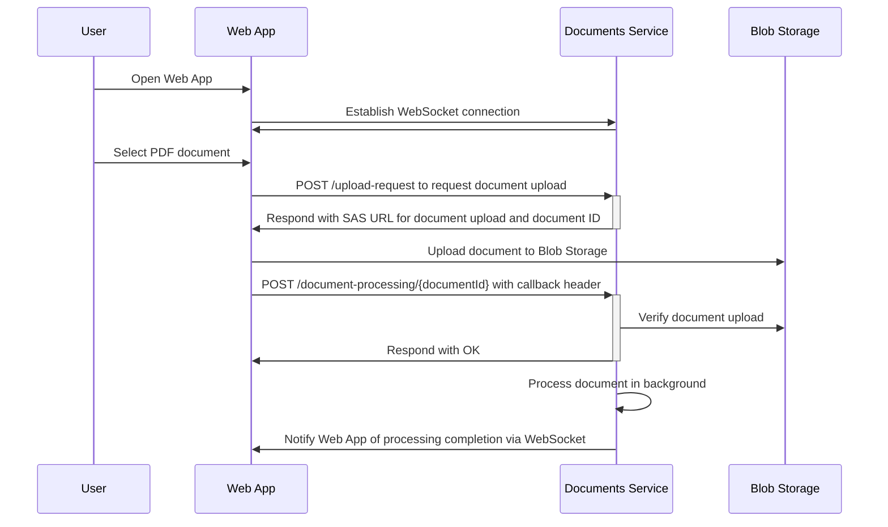
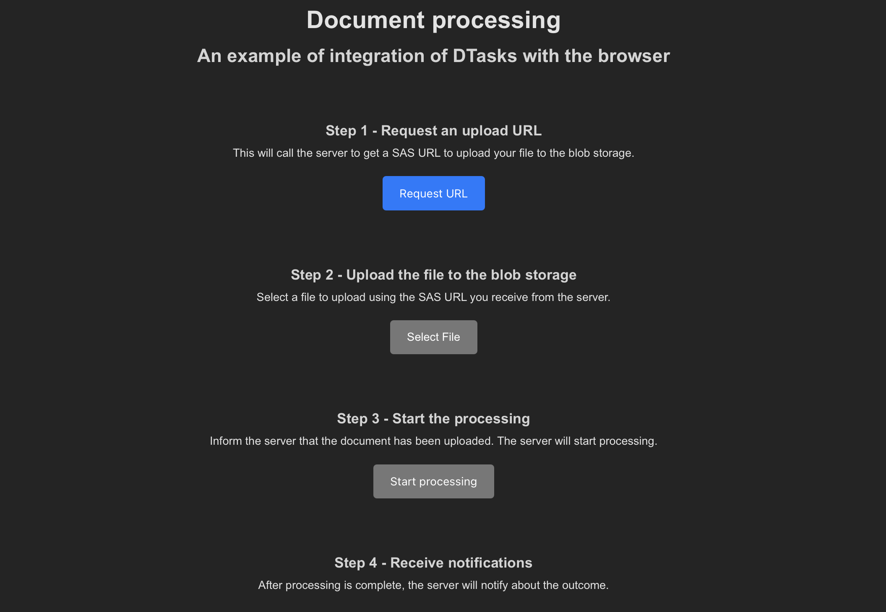
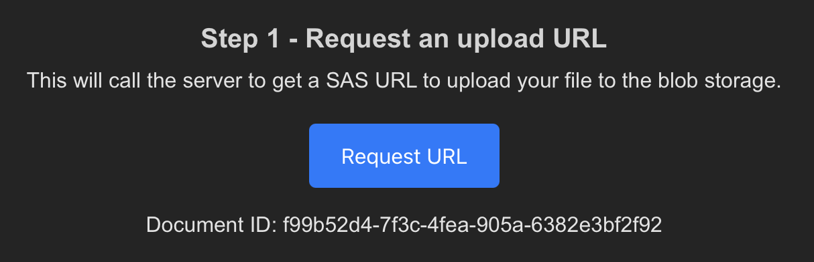
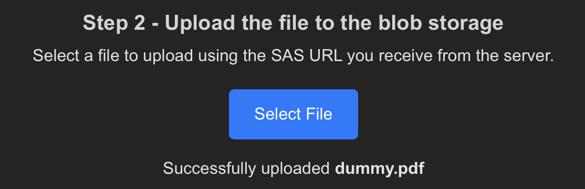
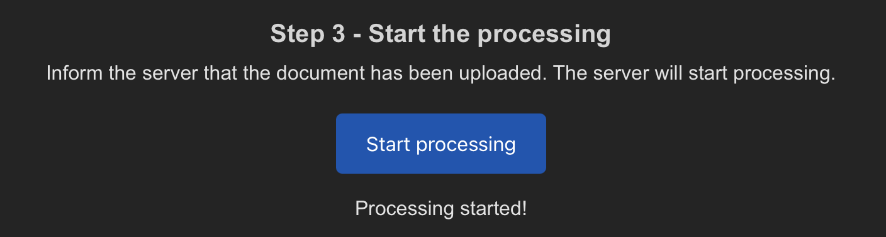
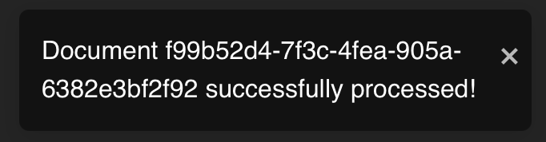

# DocumentProcessing sample

This sample demonstrates how DTasks can be used to easily define a long-running operation that interacts with a web app. In this case, the sample consists of two main components:

- The **Documents** service (server) - Defines an asynchronous endpoint that starts the processing of a document uploaded by the caller.
- The **Web App** (client) - A React SPA that provides a UI for starting and monitoring the document processing.

## Workflow

1. The user opens the web app, which establishes a WebSocket connection with the server.
2. The user selects the PDF document they want to process.
3. The app sends a request to the server for a URL where the file can be uploaded. The server responds with a SAS URL and an ID that identifies the document.
4. The app uses the provided URL to upload the document to blob storage.
5. The app then requests the Documents service to start the document processing by providing the previously returned document ID. The service verifies that the document was successfully uploaded and starts the processing in the background.
6. Once processing is complete, the server notifies the client via *WebSockets*.



## How you write it

DTasks enables defining the document processing workflow with a single d-async method (an async method returning `DTask`), rather than writing multiple components:

- A method containing the logic for starting processing, which corresponds to the `/process-document/{documentId}` endpoint.
- A background job that processes the document.
- Logic to persist the workflow state.

With DTasks, this can be achieved by defining a single method that represents the whole workflow by defining its steps, eliminating the need for explicit workflow orchestration.

```csharp
using Azure.Storage.Blobs;
using DTasks;
using DTasks.AspNetCore;
using Microsoft.AspNetCore.Mvc;

namespace Documents;

public class AsyncEndpoints(BlobContainerClient containerClient)
{
    [HttpPost("/process-document/{documentId}")]
    public async DTask<IResult> ProcessDocument(string documentId)
    {
        // Verify that the document was actually uploaded
        bool exists = await DocumentExistsAsync(documentId); // Await any "normal" Tasks, including those that are non-deterministic or have side effects
        if (!exists)
            return Results.NotFound();

        await DTask.Yield(); // Returns control to the caller

        // Simulating the processing with a delay
        await Task.Delay(TimeSpan.FromSeconds(30));

        return AsyncResults.Success(); // If you need to return IResult, use AsyncResults.Success to terminate the workflow
    }

    private async Task<bool> DocumentExistsAsync(string documentId)
    {
        string blobName = $"{documentId}.pdf";
        BlobClient blobClient = containerClient.GetBlobClient(blobName);
        return await blobClient.ExistsAsync();
    }
}
```

> How DTasks will interact with the WebSockets connection is yet to be determined. Most ASP.NET Core apps will use SignalR and integrating DTasks with it is certainly a future development. Right now, the sample contains placeholder code to make the operations work.

### Monitoring the Workflow Status

In addition to this, you get an endpoint to monitor the status of the workflow.
After starting an approval, an operation ID is associated with the instance of the workflow and can be used to retrieve its status and result.

For example, calling `GET /process-document/{operationId}` before a result is available would return:

```json
{
    "status": "running"
}
```

Once the workflow completes, the response would be:

```json
{
    "status": "succeeded"
}
```

## How it works

> ⚠️ **Note**: The DTasks.AspNetCore is a work in progress, and many of its functionalities, including code generation, are still to be implemented. The sample code provides placeholders for what will eventually be generated, enclosed in a "Generated" region or placed in a "Generated" folder. This code is not final, and its purpose is to show how the sample works behind the scenes.

Based on the code in the `AsyncEndpoint`, two endpoints are generated:

1. `POST /process-document/{documentId}`: Generated from the `[HttpPost("process-document/{documentId}")]` attribute on the `ProcessDocument` method of `AsyncEndpoints`. This endpoint behaves as expected but returns a response after the first d-async yield point (after `await DTask.Yield`), rather than at the end of the method.
2. `GET /process-document/{operationId}`: This endpoint is automatically generated to monitor the workflow status and retrieve its result.

## How to run the sample

This section shows how to run the sample to see DTasks in action.

### Prerequisites

- .NET 9
- Docker Desktop
- Node.JS >= v23.10.0
- Any PDF document (you can use the `dummy.pdf` file in this folder)

### 1. Starting the services

This folder contains a *docker-compose.yml* file that can be used to spin up containers that support the persistence and the email feature of this sample.

To start, make sure Docker Desktop is running and that there are no running containers that may conflict with the ones used in this sample.
Then, simply open a terminal, run `docker compose up`, and wait for the containers to be up and running.
This will start the following services:

- An **Azurite** container (exposed on ports 10000, 10001, 10002) - used for uploading the documents.
- A **Redis** instance (exposed on port 6379) used to persist the workflow status.

### 2. Starting the Documents Service

Open a new terminal window, and navigate to the Documents subfolder.
Then, run `dotnet run`.
This will start the **Documents** service, running on port 5262.

In a new terminal window, open the app subfolder and, if this is the first time running this sample, run `npm i`.
Then, run `npm run dev` to start the web app, which will be available on port 5173.

Now, you can navigate to `http://localhost:5173/` to open the app.



The UI already outlines the steps of the workflow, so let's start following them.

### 3. Request an upload URL

Click on the "Request URL" button.
This will call the server to get a SAS URL to upload your file to the blob storage.

After the request is completed, the UI will display the id assigned to the document.



### 4. Upload the file to the blob storage

Now, we need to select a PDF file to upload using the SAS URL we received from the server.
Click on the "Select file" button and choose your PDF file.

After you do this, the web app will upload it on the blob storage and it should show a message indicating success.



### 5. Start the processing

Click on "Start processing" to inform the server that the document has been uploaded.
The server will verify the document was uploaded and start processing.
In fact, there is no processing: it's just a long delay that the client will not experience since the server responds with 202 Accepted right after verifying the document exists on the blob storage.
You see this because the UI immediately shows a message telling that the processing has started.



### 6. Receive notifications

After processing is complete, the server will notify the app about the outcome using the established *WebSockets connection*.
So, just wait 30 seconds and if everything worked like expected, you should see a notification in the bottom-right corner informing you that the operation completed.



## Feedback

Feel free to experiment with this sample!
Keep in mind that the project is still in its early stages, and changes to the code may lead to errors or unexpected behavior.

If you discover something worth sharing or notice any discrepancies with the steps above, please do reach out by either [opening an issue](https://github.com/GianvitoDifilippo/DTasks/issues) or by [sending an email](mailto:gianvito.difilippo@gmail.com).

Thanks for reading so far and happy coding! 😄
